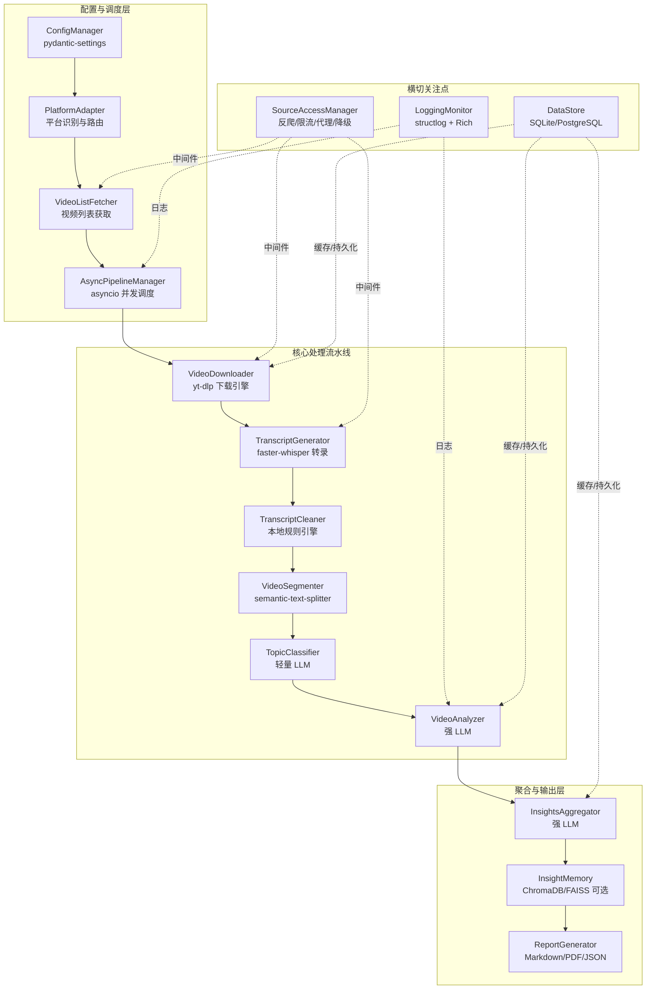
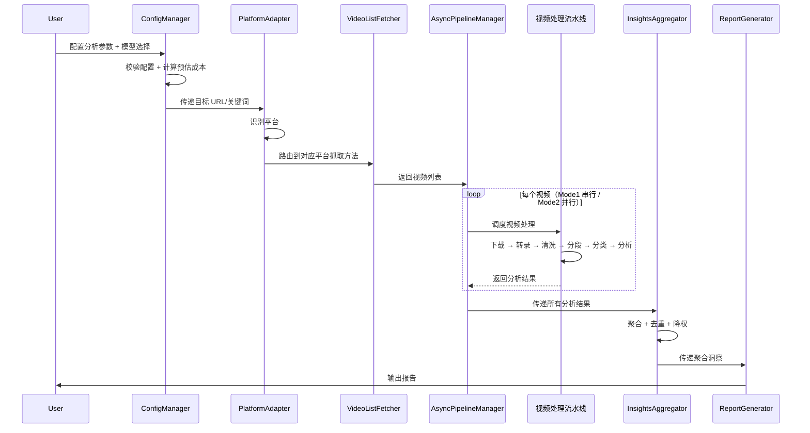

# 技术设计文档

## 概述

Multi-Platform Video Insight Skill System（OpenClaw）是一个基于 Python 3.11+ 的多平台视频洞察分析系统。系统通过异步流水线架构，从 B站、抖音、YouTube、小红书等平台抓取视频内容，经过转录、清洗、分段、分类、深度分析和聚合，最终生成结构化的商业洞察报告。

系统支持两种分析模式：
- **Mode1（单博主分析）**：深度提取单个博主的视频认知与商业洞察
- **Mode2（赛道/主题分析）**：横向分析多博主视频，提炼趋势、共识与商业机会

核心设计原则：
1. **分层模型策略**：本地处理（清洗/分段）→ 轻量 LLM（分类）→ 强 LLM（分析/聚合），最大化性价比
2. **横切关注点中间件化**：SourceAccessManager 统一管理反爬、限流、代理、降级
3. **全链路质量评分**：所有分析结果附带 confidence_score，支持质量过滤和降权
4. **容错与断点续传**：每步失败可降级，DataStore 记录检查点支持恢复

## 架构

### 高层架构

系统采用异步流水线架构，分为三层：配置与调度层、核心处理流水线、横切关注点层。



### 数据流




### 项目结构

```
openclaw/
├── config.yaml                    # 主配置文件
├── pyproject.toml
├── openclaw/
│   ├── __init__.py
│   ├── main.py                    # CLI 入口
│   ├── config/
│   │   ├── __init__.py
│   │   ├── settings.py            # pydantic-settings 配置模型
│   │   └── presets.py             # LLM 预设方案定义
│   ├── adapters/
│   │   ├── __init__.py
│   │   ├── base.py                # BasePlatformAdapter 抽象基类
│   │   ├── bilibili.py
│   │   ├── douyin.py
│   │   ├── youtube.py
│   │   └── xiaohongshu.py
│   ├── pipeline/
│   │   ├── __init__.py
│   │   ├── manager.py             # AsyncPipelineManager
│   │   ├── downloader.py          # VideoDownloader
│   │   ├── transcriber.py         # TranscriptGenerator
│   │   ├── cleaner.py             # TranscriptCleaner
│   │   ├── segmenter.py           # VideoSegmenter
│   │   ├── classifier.py          # TopicClassifier
│   │   └── analyzer.py            # VideoAnalyzer
│   ├── aggregation/
│   │   ├── __init__.py
│   │   ├── aggregator.py          # InsightsAggregator
│   │   └── memory.py              # InsightMemory（可选）
│   ├── report/
│   │   ├── __init__.py
│   │   └── generator.py           # ReportGenerator
│   ├── middleware/
│   │   ├── __init__.py
│   │   └── access_manager.py      # SourceAccessManager
│   ├── storage/
│   │   ├── __init__.py
│   │   ├── datastore.py           # DataStore 抽象层
│   │   ├── sqlite_backend.py
│   │   └── postgres_backend.py
│   ├── llm/
│   │   ├── __init__.py
│   │   ├── client.py              # 统一 LLM 客户端
│   │   ├── prompts.py             # Prompt 模板
│   │   └── schemas.py             # JSON Schema 定义
│   ├── monitoring/
│   │   ├── __init__.py
│   │   └── logger.py              # LoggingMonitor
│   └── models/
│       ├── __init__.py
│       └── types.py               # Pydantic 数据模型
├── tests/
│   ├── conftest.py
│   ├── fixtures/                  # 测试数据
│   ├── unit/
│   ├── integration/
│   └── property/                  # 属性测试
└── cookies/                       # Cookie 文件（gitignore）
```

## 组件与接口

### ConfigManager

负责统一配置管理，使用 pydantic-settings 实现类型安全校验。

```python
from pydantic_settings import BaseSettings
from pydantic import Field
from typing import Optional, Dict, List
from enum import Enum

class LLMPreset(str, Enum):
    COST_EFFECTIVE = "cost_effective"  # 方案A
    QUALITY = "quality"                # 方案B
    FLAGSHIP = "flagship"              # 方案B+
    CHINA_ECO = "china_eco"            # 方案C
    CUSTOM = "custom"

class LLMProviderConfig(BaseSettings):
    api_key: str
    base_url: str

class LLMModelConfig(BaseSettings):
    provider: str
    model: str
    max_tokens: int = 4096
    temperature: float = 0.3

class PlatformConfig(BaseSettings):
    cookie_path: Optional[str] = None
    cookie_refresh_days: int = 7
    request_delay: tuple[float, float] = (2.0, 6.0)

class StorageConfig(BaseSettings):
    db_type: str = "sqlite"  # sqlite | postgresql
    db_path: str = "./data/openclaw.db"
    cache_enabled: bool = True
    cache_ttl_hours: int = 72

class AppSettings(BaseSettings):
    llm_providers: Dict[str, LLMProviderConfig]
    llm_preset: LLMPreset = LLMPreset.COST_EFFECTIVE
    llm_custom: Optional[Dict[str, LLMModelConfig]] = None
    platforms: Dict[str, PlatformConfig]
    storage: StorageConfig = StorageConfig()
    proxy_enabled: bool = False
    log_level: str = "INFO"

    class Config:
        env_file = ".env"
        env_nested_delimiter = "__"
```

### PlatformAdapter

自动识别 URL 来源平台并路由到对应适配器。

```python
from abc import ABC, abstractmethod
from typing import List
from openclaw.models.types import VideoInfo

class BasePlatformAdapter(ABC):
    @abstractmethod
    async def fetch_video_list(
        self, target: str, time_window: str, max_videos: int
    ) -> List[VideoInfo]:
        """获取视频列表"""

    @abstractmethod
    async def search_creators(
        self, keyword: str, max_creators: int
    ) -> List[str]:
        """搜索相关博主（Mode2）"""

class PlatformRouter:
    PLATFORM_PATTERNS: Dict[str, type[BasePlatformAdapter]] = {
        r"bilibili\.com|b23\.tv": BilibiliAdapter,
        r"douyin\.com": DouyinAdapter,
        r"youtube\.com|youtu\.be": YouTubeAdapter,
        r"xiaohongshu\.com|xhslink\.com": XiaohongshuAdapter,
    }

    def detect_platform(self, url: str) -> BasePlatformAdapter:
        """根据 URL 正则匹配识别平台，返回对应适配器实例"""

    def resolve_platforms(self, platform_names: List[str]) -> List[BasePlatformAdapter]:
        """根据平台名称列表返回适配器实例列表（Mode2）"""
```

### AsyncPipelineManager

异步并发调度器，管理视频处理流水线。

```python
import asyncio
from typing import List
from openclaw.models.types import VideoInfo, AnalysisResult

class AsyncPipelineManager:
    def __init__(self, max_concurrency: int = 3):
        self._semaphore = asyncio.Semaphore(max_concurrency)

    async def process_single_creator(
        self, videos: List[VideoInfo]
    ) -> List[AnalysisResult]:
        """Mode1：串行处理单博主视频列表"""
        results = []
        for video in videos:
            result = await self._process_video(video)
            results.append(result)
        return results

    async def process_multi_creators(
        self, creator_videos: Dict[str, List[VideoInfo]]
    ) -> List[AnalysisResult]:
        """Mode2：并行处理多博主，每博主内部串行"""
        tasks = [
            self._process_creator_with_semaphore(creator, videos)
            for creator, videos in creator_videos.items()
        ]
        results = await asyncio.gather(*tasks, return_exceptions=True)
        return self._flatten_results(results)

    async def _process_video(self, video: VideoInfo) -> AnalysisResult:
        """单视频处理流水线：下载→转录→清洗→分段→分类→分析"""
```

### SourceAccessManager

作为中间件贯穿所有网络请求模块。

```python
import asyncio
import random
from typing import Optional, Callable, Any

class SourceAccessManager:
    def __init__(self, config: AppSettings):
        self._global_semaphore = asyncio.Semaphore(2)  # 全局最大并发 2
        self._platform_locks: Dict[str, asyncio.Lock] = {}
        self._platform_last_request: Dict[str, float] = {}
        self._failure_counts: Dict[str, int] = {}
        self._paused_platforms: Dict[str, float] = {}

    async def request(
        self,
        platform: str,
        request_fn: Callable[..., Any],
        *args, **kwargs
    ) -> Any:
        """
        统一请求入口：
        1. 检查平台是否暂停
        2. 获取全局信号量
        3. 等待平台间隔
        4. 插入随机延时
        5. 设置请求头伪装
        6. 执行请求（含重试逻辑）
        7. 记录成功/失败
        """

    async def _retry_with_backoff(
        self, fn: Callable, max_retries: int = 3
    ) -> Any:
        """指数退避重试：1s, 2s, 4s"""

    def _get_headers(self, platform: str) -> Dict[str, str]:
        """生成伪装请求头：UA 池轮换、Referer、Accept-Language"""

    async def _rotate_proxy(self) -> Optional[str]:
        """代理轮换（如果启用）"""
```

### VideoDownloader

视频下载模块，实现降级策略链。

```python
from enum import Enum
from openclaw.models.types import VideoInfo, DownloadResult

class DownloadMethod(str, Enum):
    SUBTITLE = "subtitle"
    AUDIO = "audio"
    SKIPPED = "skipped"

class VideoDownloader:
    async def download(self, video: VideoInfo) -> DownloadResult:
        """
        降级策略链：
        1. 尝试获取字幕文件（B站优先 CC 字幕）
        2. 失败则降级为下载音频
        3. 再失败则跳过并记录原因
        """

    async def _fetch_subtitle(self, video: VideoInfo) -> Optional[str]:
        """通过 yt-dlp 获取字幕文件"""

    async def _download_audio(self, video: VideoInfo) -> Optional[str]:
        """通过 yt-dlp 下载音频文件"""
```

### TranscriptGenerator

```python
class TranscriptGenerator:
    async def transcribe(self, download_result: DownloadResult) -> TranscriptResult:
        """
        - 如果有字幕文件：解析字幕为带时间戳文本
        - 如果是音频文件：调用 faster-whisper 转录
        - 输出包含时间戳信息的转录文本
        """
```

### TranscriptCleaner

本地规则引擎，不消耗 LLM token。

```python
class TranscriptCleaner:
    def __init__(self):
        self._filler_words: Set[str]       # 口头禅词库
        self._ad_keywords: Set[str]        # 广告关键词库
        self._ad_patterns: List[re.Pattern] # 广告正则模式

    def clean(self, transcript: str) -> str:
        """
        本地规则引擎清洗：
        1. 正则匹配去除广告段落
        2. 口头禅词库过滤
        3. 重复段落去重
        """

    async def clean_with_fallback(self, transcript: str) -> str:
        """规则引擎处理不了时，降级使用轻量 LLM"""
```

### VideoSegmenter

本地语义分段，不消耗 LLM token。

```python
from semantic_text_splitter import TextSplitter

class VideoSegmenter:
    def __init__(self, max_chunk_size: int = 2000):
        self._splitter = TextSplitter(max_chunk_size)

    def segment(self, cleaned_text: str) -> List[str]:
        """基于语义相似度分段，返回文本片段列表"""
        return self._splitter.chunks(cleaned_text)
```

### TopicClassifier

前置分类模块，使用轻量 LLM。

```python
from openclaw.models.types import TopicClassification

class TopicClassifier:
    CONTENT_TYPES = [
        "观点输出", "教程讲解", "案例分析",
        "行业分析", "产品推荐", "其他"
    ]

    async def classify(self, segments: List[str]) -> TopicClassification:
        """
        调用轻量 LLM 进行主题分类：
        - 输出 primary_topic, secondary_topics, content_type, business_relevance
        - business_relevance < 0.3 时标记跳过
        - 使用严格 JSON Schema 约束输出
        """

    def should_skip(self, classification: TopicClassification) -> bool:
        """business_relevance < 0.3 返回 True"""
        return classification.business_relevance < 0.3
```

### VideoAnalyzer

核心分析模块，使用强 LLM。

```python
from openclaw.models.types import VideoAnalysis

class VideoAnalyzer:
    async def analyze(
        self,
        segments: List[str],
        topic: TopicClassification
    ) -> VideoAnalysis:
        """
        深度分析：提取 core_signals, cognition_framework,
        methodology_fragments, high_value_quotes, overall_quality
        - 使用 Few-shot 示例提高输出质量
        - 严格 JSON Schema 约束输出
        - 每个信号附带 confidence_score 和 evidence
        """
```

### InsightsAggregator

```python
from openclaw.models.types import AggregatedInsights

class InsightsAggregator:
    async def aggregate(
        self,
        analyses: List[VideoAnalysis],
        mode: str  # "single" | "multi"
    ) -> AggregatedInsights:
        """
        聚合规则：
        1. 相似信号去重合并，confidence_score 加权平均
        2. 多次出现的信号赋予更高权重
        3. overall_quality < 0.5 的结果降权
        4. 商业机会仅保留多信号支撑的判断
        5. 生成 3~5 条 insights_for_me
        6. Mode2 额外输出共识与分歧
        """
```

### ReportGenerator

```python
class ReportGenerator:
    def generate(
        self,
        insights: AggregatedInsights,
        output_format: str,  # "Markdown" | "PDF" | "JSON"
        metadata: dict
    ) -> str:
        """
        根据 output_format 生成报告：
        - Markdown：直接渲染模板
        - PDF：Markdown → PDF（使用 weasyprint 或 md2pdf）
        - JSON：直接序列化 AggregatedInsights
        """
```

### DataStore

```python
from abc import ABC, abstractmethod
from openclaw.models.types import VideoStatus

class BaseDataStore(ABC):
    @abstractmethod
    async def save_video(self, video: VideoInfo) -> None: ...

    @abstractmethod
    async def get_video_status(self, url: str) -> Optional[VideoStatus]: ...

    @abstractmethod
    async def save_transcript(self, video_id: str, transcript: TranscriptResult) -> None: ...

    @abstractmethod
    async def save_analysis(self, video_id: str, analysis: VideoAnalysis) -> None: ...

    @abstractmethod
    async def save_checkpoint(self, run_id: str, state: dict) -> None: ...

    @abstractmethod
    async def load_checkpoint(self, run_id: str) -> Optional[dict]: ...

    @abstractmethod
    async def is_cached(self, url: str, cache_ttl_hours: int) -> bool: ...

    @abstractmethod
    async def has_content_changed(self, url: str, publish_date: str, view_count: int) -> bool: ...
```

### LLM 统一客户端

```python
from typing import Type
from pydantic import BaseModel

class LLMClient:
    def __init__(self, providers: Dict[str, LLMProviderConfig]):
        self._sessions: Dict[str, aiohttp.ClientSession] = {}

    async def call(
        self,
        model_config: LLMModelConfig,
        system_prompt: str,
        user_prompt: str,
        response_schema: Type[BaseModel],
        few_shot_examples: Optional[List[dict]] = None
    ) -> BaseModel:
        """
        统一 LLM 调用接口：
        1. 根据 provider 选择对应 session
        2. 构建请求（含 JSON Schema 约束）
        3. 发送请求并解析响应
        4. 校验响应符合 response_schema
        5. 记录 token 消耗到 LoggingMonitor
        """
```


## 数据模型

### 核心 Pydantic 模型

```python
from pydantic import BaseModel, Field
from typing import List, Optional
from enum import Enum
from datetime import datetime

# ── 视频信息 ──
class VideoInfo(BaseModel):
    url: str
    title: str
    creator: str
    platform: str
    publish_date: datetime
    view_count: int

class VideoStatus(str, Enum):
    PENDING = "pending"
    DOWNLOADED = "downloaded"
    TRANSCRIBED = "transcribed"
    ANALYZED = "analyzed"
    SKIPPED = "skipped"

# ── 下载结果 ──
class DownloadResult(BaseModel):
    video_id: str
    method: str  # "subtitle" | "audio" | "skipped"
    file_path: Optional[str] = None
    subtitle_text: Optional[str] = None
    skipped_reason: Optional[str] = None

# ── 转录结果 ──
class TimestampedSegment(BaseModel):
    start: float  # 秒
    end: float
    text: str

class TranscriptResult(BaseModel):
    video_id: str
    segments: List[TimestampedSegment]
    full_text: str

# ── 主题分类 ──
class ContentType(str, Enum):
    OPINION = "观点输出"
    TUTORIAL = "教程讲解"
    CASE_STUDY = "案例分析"
    INDUSTRY = "行业分析"
    PRODUCT = "产品推荐"
    OTHER = "其他"

class TopicClassification(BaseModel):
    primary_topic: str
    secondary_topics: List[str] = []
    content_type: ContentType
    business_relevance: float = Field(ge=0.0, le=1.0)
    skip_reason: Optional[str] = None

# ── 视频分析结果 ──
class CoreSignal(BaseModel):
    signal: str
    evidence: str
    confidence_score: float = Field(ge=0.0, le=1.0)

class CognitionFramework(BaseModel):
    framework: str
    reasoning_chain: str
    confidence_score: float = Field(ge=0.0, le=1.0)

class MethodologyFragment(BaseModel):
    method: str
    applicable_scenario: str
    confidence_score: float = Field(ge=0.0, le=1.0)

class HighValueQuote(BaseModel):
    quote: str
    context: str

class VideoAnalysis(BaseModel):
    video_id: str
    core_signals: List[CoreSignal]
    cognition_framework: List[CognitionFramework]
    methodology_fragments: List[MethodologyFragment]
    high_value_quotes: List[HighValueQuote]
    overall_quality: float = Field(ge=0.0, le=1.0)

# ── 聚合洞察 ──
class BusinessOpportunity(BaseModel):
    direction_judgment: List[dict]  # {"judgment": str, "confidence_score": float}
    verifiable_hypotheses: List[dict]  # {"hypothesis": str, "confidence_score": float}

class QualitySummary(BaseModel):
    overall_confidence: float = Field(ge=0.0, le=1.0)
    low_quality_signals_count: int
    notes: str

class Mode1Insights(BaseModel):
    metadata: dict
    core_signals: List[dict]
    cognition_framework: List[dict]
    methodology_fragments: List[dict]
    business_opportunities: BusinessOpportunity
    high_value_quotes: List[dict]
    insights_for_me: List[str]
    quality_summary: QualitySummary

class ConsensusAndDivergence(BaseModel):
    consensus: List[dict]
    divergence: List[dict]

class Mode2Insights(BaseModel):
    metadata: dict
    trend_signals: List[dict]
    consensus_and_divergence: ConsensusAndDivergence
    common_methodology: List[dict]
    business_opportunities: BusinessOpportunity
    high_value_quotes: List[dict]
    insights_for_me: List[str]
    quality_summary: QualitySummary
```

### 数据库 Schema

```sql
-- 视频信息表
CREATE TABLE videos (
    id TEXT PRIMARY KEY,
    platform TEXT NOT NULL,
    url TEXT UNIQUE NOT NULL,
    title TEXT NOT NULL,
    creator TEXT NOT NULL,
    publish_date TIMESTAMP,
    view_count INTEGER DEFAULT 0,
    status TEXT DEFAULT 'pending',  -- pending/downloaded/transcribed/analyzed/skipped
    skipped_reason TEXT,
    fetched_at TIMESTAMP DEFAULT CURRENT_TIMESTAMP,
    run_id TEXT
);

-- 转录文本表
CREATE TABLE transcripts (
    id TEXT PRIMARY KEY,
    video_id TEXT NOT NULL REFERENCES videos(id),
    raw_text TEXT,
    cleaned_text TEXT,
    segments JSON,  -- List[TimestampedSegment]
    created_at TIMESTAMP DEFAULT CURRENT_TIMESTAMP
);

-- 分析结果表
CREATE TABLE analyses (
    id TEXT PRIMARY KEY,
    video_id TEXT NOT NULL REFERENCES videos(id),
    topic_classification JSON,
    analysis_result JSON,
    confidence_score REAL,
    created_at TIMESTAMP DEFAULT CURRENT_TIMESTAMP
);

-- 聚合洞察表
CREATE TABLE insights (
    id TEXT PRIMARY KEY,
    run_id TEXT NOT NULL,
    mode TEXT NOT NULL,  -- single/multi
    target TEXT NOT NULL,
    aggregated_result JSON,
    created_at TIMESTAMP DEFAULT CURRENT_TIMESTAMP
);

-- 运行日志表
CREATE TABLE run_logs (
    id TEXT PRIMARY KEY,
    run_id TEXT NOT NULL,
    step TEXT NOT NULL,
    status TEXT NOT NULL,  -- success/failed/skipped
    duration_ms INTEGER,
    error_message TEXT,
    token_usage JSON,  -- {"input_tokens": int, "output_tokens": int, "cost": float}
    created_at TIMESTAMP DEFAULT CURRENT_TIMESTAMP
);

-- 检查点表（断点续传）
CREATE TABLE checkpoints (
    run_id TEXT PRIMARY KEY,
    state JSON NOT NULL,
    updated_at TIMESTAMP DEFAULT CURRENT_TIMESTAMP
);

-- 模型配置持久化表
CREATE TABLE saved_configs (
    name TEXT PRIMARY KEY,
    config JSON NOT NULL,
    is_last_used BOOLEAN DEFAULT FALSE,
    created_at TIMESTAMP DEFAULT CURRENT_TIMESTAMP,
    updated_at TIMESTAMP DEFAULT CURRENT_TIMESTAMP
);
```

